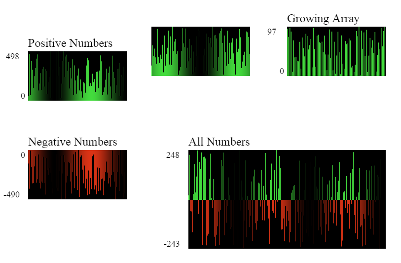
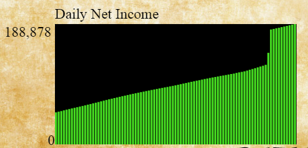
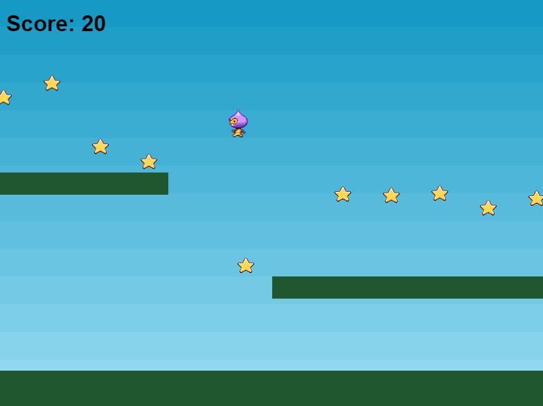
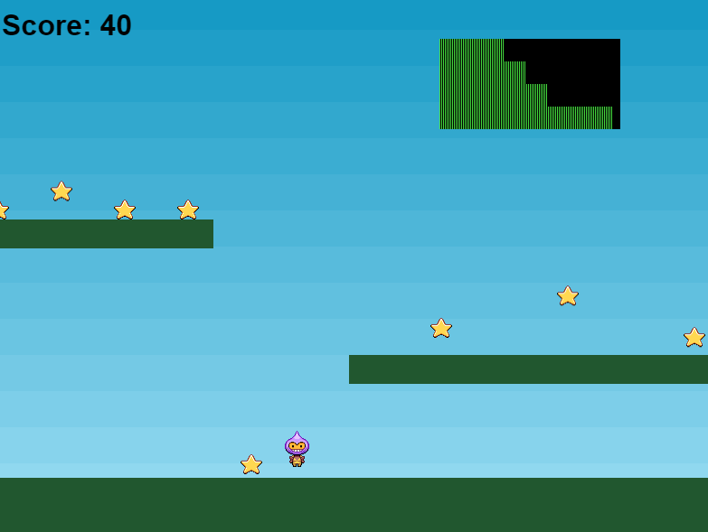

<h1><strong>Phaser.io Barchart Plugin</strong></h1>

 
This is a plugin for Phaser.io,  a popular open source game framework.
 
Specifically, it generates a bar graph from an array of numbers.
 

<h3><strong>Setup</strong></h3>
 
To use this plugin, please take the following steps:
  
On your index page, you need to reference a copy of the plugin code (phaser-barchart.js), like this:
<code>

    

</code>
Within your game's first preload function, load the plugin with this command:
<pre>

game.plugin = game.plugins.add(Phaser.Plugin.BarchartPlugin);

</pre>
You are now able to use the plugin in your Phaser code.
 
<h3><strong>Usage</strong></h3>
 
The plugin has two public methods: <strong>addChart</strong> and <strong>updateChart</strong>.
  
The addChart method is used like this:
<pre>

this.newChart = game.plugin.addChart(valueArray, x, y, width, height, label, hideLabels);

</pre>
This will create a bar graph object. The variables are:
  
<ul>
    <li><strong>valueArray.</strong> An array of numbers.</li>
    <li><strong>x</strong>. The x-coordinate of the graph (aligned with its left side) </li>
    <li><strong>y</strong>. The y-coordinate of the graph (aligned with its upper side)</li>
    <li><strong>width</strong>. The graph width, in pixels.</li>
    <li><strong>height</strong>. The graph height, in pixels.</li>
    <li><strong>label</strong>. A string placed above the graph; usually a description.</li>
    <li><strong>hideLabels (optional)</strong>. If this is set to "true," the graph will not show its label, nor will it mark the y-axis. By default this is "false."</li>
</ul>
 
Although a graph can be static, the second method, updateChart, adds a dynamic functionality to the graph object it's called for, such as:
<pre>

newChart.updateChart(newArray);

</pre>
This command will update the entire graph, depending on the numbers used.
  
The easiest way to update the chart on a regular basis is to add a Phaser timer, then use that to call a function that updates both the array and the graph. For example:
<pre>
    this.numberArray = [1.2, 4.2, 5.1, 5.5, 6.3];
    ...
    this.anotherGraph = game.plugin.addChart(this.numberArray, 600, 100, 200, 100, "Another Graph");
    this.gameTimer = game.time.events.loop(1000, game.updateCharts, this);
    ...
    game.updateCharts = function() {
        this.numberArray.unshift(Math.random() * 10); //add a new number to the front of the array
        this.numberArray.pop(); //remove last item in array
        this.anotherGraph.updateChart(this.numberArray);
    };
    
</pre>
 
HINT: The best way to handle the updateChart array is to unshift new values to the front. It may also be useful to pop the oldest element, although this isn't necessary.
 
<h3><strong>Useful Features</strong></h3>
 
I have tried to make this plugin as robust and flexible as possible. Among these features:
  
<ul>
    <li>The plugin will automatically determine the y-axis numerical labels based on the highest and lowest numbers in the array.</li>
    <li>If a graph is updated with a larger (or smaller) array, the plugin adjusts the bar width every time the array size changes.</li>
    <li>The plugin can generate numerous graphs, in case someone decides to place two or more of them at once.</li>
    <li> If the plugin determines the array is too large to properly display the graph (the number of elements must be less than or equal to half of the graph's width), it will remove items from the end of the array.</li>
    <li>Graphs can handle both positive and negative numbers. In addition, graphs can plot both positive and negative points at the same time. In this case, the graph will determine a "zero point," then plot positive numbers (green, with bars pointing upwards) and negative numbers (red, pointing downwards), all from the zero point.</li>
</ul>
 
<h3><strong>Examples</strong></h3>
 

My idle game at Newgrounds, <a href="http://www.newgrounds.com/portal/view/687176" target="_blank"><em>The Townsfolk Cartel</em></a>, is the first place I used this plugin (in fact, I created the plugin because that game needed this functionality). When playing the game, press on the "Statistics" button. The graph there shows the last 90 days or so of income, so that players can see how they're doing.
  
If you open the index.html page in this directory, you will see several different style of graph, all created with the plugin. The main.js file creates and updates all the graphs. The code in the create function creates five graphs, while the timerUpdate function updates three of them, along with their number arrays.
 
<h3><strong>A Tutorial Exercise</strong></h3>
 
To demonstrate how this plugin works, I will show how to add a graph to an existing Phaser.io program. For this, I have included the code from Phaser.io that is <a href="http://phaser.io/tutorials/making-your-first-phaser-game", target="_blank">used as a tutorial for newcomers</a>. To see this, open the tutorial.html file instead of index.html. The game should start immediately.
  

As you can see, the game is extremely simple. You just need to move the character around with arrow keys and collect starts for points.
  
Suppose, for some strange reason, the game had a timer, and you wanted to see what the score was for each second. This is your exercise - make the following modifications to the tutorial.html file:
  
<ol>
    <li>Add the plugin file to the HTML5 head. Remember: the instructions on this are located above, under the Setup header. Also keep in mind: the plugin file is at vendor/phaser-barchart.js. <strong>Be careful</strong> - don't reference the plugin before the phaser.js file, else you'll get an error.</li>
    <li>The next step is to make the plugin available in the Phaser program. Again, this was discussed in the above instructions. Can you find the preload function?</li>
    <li>The graph will require an array of numbers as input; in this case, those numbers are the score, recorded every second. So, we need to create an array, then, once a second, add the current score into it. How to do this? Well, first you should create a blank array (since this is primitive code, feel free to create it as a global variable, along with the graph itself). Next, you'll need to add a game timer loop, and every second, update this array. If you read the Usage section, you should know how. HINT - you'll at least need to add a new function.
    </li>
    <li>Now you can place a graph on the screen. The instructions are under the Usage header above. You can assume the following:
        <ul>
            <li>The graph should be placed in the upper-right corner, unreachable to the character.</li>
            <li>The graph should be small enough not to interfere with the game.</li>
        </ul>
   </li>
   <li>Finally, you'll need to update the score graph every second. HINT: if you already made a function to handle the timed update of the score array, you should be able to include the graph update there.</li>
</ol>
 
If you succeeded, you should see a game like this. Graphing scores doesn't seem very useful, but there are many games where this will help.

  
CHEAT: If you want to see the finished code for this, look for the file called "finished.html" in the assets folder. But please try to solve it yourself first.
